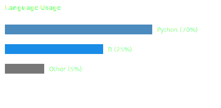
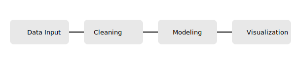

<h1 align="center">Hi, I'm Randi 👋</h1>

Minimalist data enthusiast working with <b>Python</b> and <b>R</b> for analytics, visualization, and automation.

---

## 📌 Featured Projects

### 🔍 Data Analytics & Visualization
- **Customer Segmentation (Python)**  
  Clustering & behavioral insights using Pandas, scikit-learn, and Matplotlib.  
  👉 `link-project-1`

- **Forecasting Dashboard (R Shiny)**  
  Time-series forecasting with interactive visualizations in Shiny.  
  👉 `link-project-2`

---

## 🧠 What I Do
- Data cleaning & wrangling  
- Exploratory Data Analysis (EDA)  
- Statistical modeling & forecasting  
- Dashboarding (Python / R Shiny)  
- Data visualization & reporting  

---

## 🧰 Tech Stack

**Languages**
- Python  
- R  

**Python**
- Pandas, NumPy  
- Matplotlib, Seaborn  
- FastAPI / scripting / automation  

**R**
- Tidyverse  
- ggplot2  
- Shiny  

---

## 📊 GitHub Overview

<table>
  <tr>
    <td>
      
    </td>
    <td>
      
    </td>
  </tr>
</table>

---

## 🧪 Data Scientist Visuals

<!-- Programming Language Usage Chart -->

  

<!-- Data Workflow Diagram -->

  

---

## 🌱 Current Focus
- Improving my skills in statistical modeling & forecasting  
- Building clean, minimal dashboards for real-world data  
- Writing reproducible, well-documented code  

---

## 📨 Contact

- Email: *your-email@example.com*  
- Open to collaboration on data projects, dashboards, and experiments.
