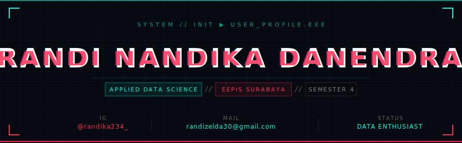

<div align="center">

<!-- Cyberpunk Glitch Header SVG -->


<!-- Typing Animation -->
<a href="https://git.io/typing-svg">
  
</a>

<br/>

[](https://www.instagram.com/randika234_)
&nbsp;
[](mailto:randizelda30@gmail.com)
&nbsp;


</div>

---

## 🧑‍💻 About Me

```python
randi = {
    "name"      : "Randi Nandika Danendra",
    "study"     : "Applied Data Science — EEPIS, Surabaya (Semester 4)",
    "focus"     : ["Machine Learning", "Data Analysis", "Data Visualization"],
    "building"  : ["Interactive Dashboards", "ML Models for Web & Android"],
    "exploring" : ["Deep Learning", "Computer Vision"],
    "fun_fact"  : "Debugging ML models is more fun than sleeping 😅"
}
```

---

## 🛠️ Tech Stack

### 🤖 Machine Learning & Data Science
<p>
  
  
  
  
  
  
  
  
  
  
</p>

### 📊 Dashboard & Visualization
<p>
  
  
  
  
</p>

### 🌐 Web & Mobile Development
<p>
  
  
  
  
  
  
  
  
</p>

### 🗄️ Database & Cloud
<p>
  
  
  
  
  
</p>

### 🎨 Design & Creative Tools
<p>
  
  
</p>

---

## 📈 GitHub Stats

<div align="center">
  
  &nbsp;&nbsp;
  
</div>

<div align="center">
  
</div>

---

## 🚀 Current Focus

- 🔬 &nbsp; Exploring **Deep Learning** & **Computer Vision**
- 📦 &nbsp; Deploying ML models to **Web Apps** & **Android**
- 📊 &nbsp; Building interactive data dashboards with **Streamlit**
- 🤝 &nbsp; Open to **collaborations** on data science & ML projects

---

<div align="center">
  
</div>
